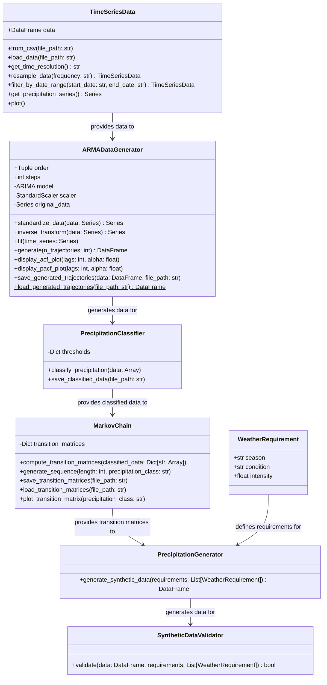

```mermaid
classDiagram
    class TimeSeriesData {
        +DataFrame data
        +from_csv(file_path: str)$
        +load_data(file_path: str)
        +get_time_resolution() str
        +resample_data(frequency: str) TimeSeriesData
        +filter_by_date_range(start_date: str, end_date: str) TimeSeriesData
        +get_precipitation_series() Series
        +plot()
    }

    class ARMADataGenerator {
        +Tuple order
        +int steps
        -ARIMA model
        -StandardScaler scaler
        -Series original_data
        +standardize_data(data: Series) Series
        +inverse_transform(data: Series) Series
        +fit(time_series: Series)
        +generate(n_trajectories: int) DataFrame
        +display_acf_plot(lags: int, alpha: float)
        +display_pacf_plot(lags: int, alpha: float)
        +save_generated_trajectories(data: DataFrame, file_path: str)
        +load_generated_trajectories(file_path: str)$ DataFrame
    }

    class PrecipitationClassifier {
        -Dict thresholds
        +classify_precipitation(data: Array)
        +save_classified_data(file_path: str)
    }

    class MarkovChain {
        -Dict transition_matrices
        +compute_transition_matrices(classified_data: Dict[str, Array])
        +generate_sequence(length: int, precipitation_class: str)
        +save_transition_matrices(file_path: str)
        +load_transition_matrices(file_path: str)
        +plot_transition_matrix(precipitation_class: str)
    }

    class WeatherRequirement {
        +str season
        +str condition
        +float intensity
    }

    class SyntheticDataValidator {
        +validate(data: DataFrame, requirements: List[WeatherRequirement]) bool
    }

    class PrecipitationGenerator {
        +generate_synthetic_data(requirements: List[WeatherRequirement]) DataFrame
    }

    TimeSeriesData --> ARMADataGenerator: provides data to
    ARMADataGenerator --> PrecipitationClassifier: generates data for
    PrecipitationClassifier --> MarkovChain: provides classified data to
    MarkovChain --> PrecipitationGenerator: provides transition matrices to
    WeatherRequirement --> PrecipitationGenerator: defines requirements for
    PrecipitationGenerator --> SyntheticDataValidator: generates data for
```