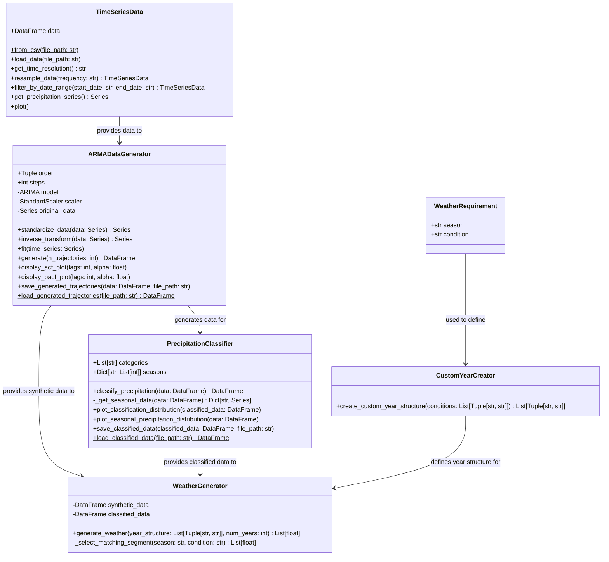

```mermaid
classDiagram
    class TimeSeriesData {
        +DataFrame data
        +from_csv(file_path: str)$
        +load_data(file_path: str)
        +get_time_resolution() str
        +resample_data(frequency: str) TimeSeriesData
        +filter_by_date_range(start_date: str, end_date: str) TimeSeriesData
        +get_precipitation_series() Series
        +plot()
    }

    class ARMADataGenerator {
        +Tuple order
        +int steps
        -ARIMA model
        -StandardScaler scaler
        -Series original_data
        +standardize_data(data: Series) Series
        +inverse_transform(data: Series) Series
        +fit(time_series: Series)
        +generate(n_trajectories: int) DataFrame
        +display_acf_plot(lags: int, alpha: float)
        +display_pacf_plot(lags: int, alpha: float)
        +save_generated_trajectories(data: DataFrame, file_path: str)
        +load_generated_trajectories(file_path: str)$ DataFrame
    }

    class PrecipitationClassifier {
        +List[str] categories
        +Dict[str, List[int]] seasons
        +classify_precipitation(data: DataFrame) DataFrame
        -_get_seasonal_data(data: DataFrame) Dict[str, Series]
        +plot_classification_distribution(classified_data: DataFrame)
        +plot_seasonal_precipitation_distribution(data: DataFrame)
        +save_classified_data(classified_data: DataFrame, file_path: str)
        +load_classified_data(file_path: str)$ DataFrame
    }

    class CustomYearCreator {
        +create_custom_year_structure(conditions: List[Tuple[str, str]]) List[Tuple[str, str]]
    }

    class WeatherGenerator {
        -DataFrame synthetic_data
        -DataFrame classified_data
        +generate_weather(year_structure: List[Tuple[str, str]], num_years: int) List[float]
        -_select_matching_segment(season: str, condition: str) List[float]
    }

    class WeatherRequirement {
        +str season
        +str condition
    }

    TimeSeriesData --> ARMADataGenerator: provides data to
    ARMADataGenerator --> PrecipitationClassifier: generates data for
    ARMADataGenerator --> WeatherGenerator: provides synthetic data to
    PrecipitationClassifier --> WeatherGenerator: provides classified data to
    CustomYearCreator --> WeatherGenerator: defines year structure for
    WeatherRequirement --> CustomYearCreator: used to define
```