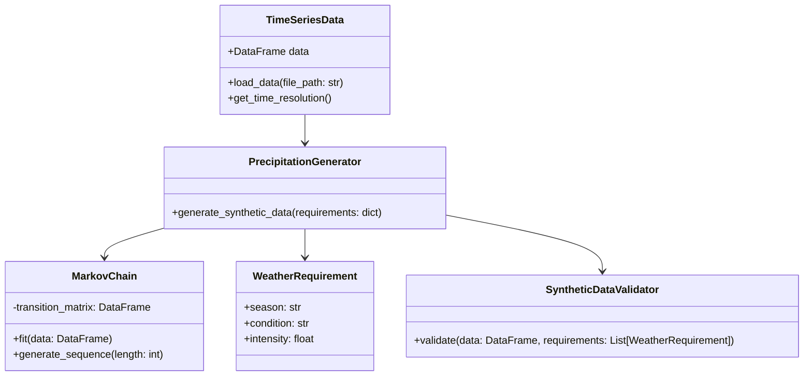

```mermaid
classDiagram
    class TimeSeriesData {
        +DataFrame data
        +load_data(file_path: str)
        +get_time_resolution()
    }

    class PrecipitationGenerator {
        +generate_synthetic_data(requirements: dict)
    }

    class MarkovChain {
        -transition_matrix: DataFrame
        +fit(data: DataFrame)
        +generate_sequence(length: int)
    }

    class WeatherRequirement {
        +season: str
        +condition: str
        +intensity: float
    }

    class SyntheticDataValidator {
        +validate(data: DataFrame, requirements: List[WeatherRequirement])
    }

    TimeSeriesData --> PrecipitationGenerator
    PrecipitationGenerator --> MarkovChain
    PrecipitationGenerator --> WeatherRequirement
    PrecipitationGenerator --> SyntheticDataValidator
```