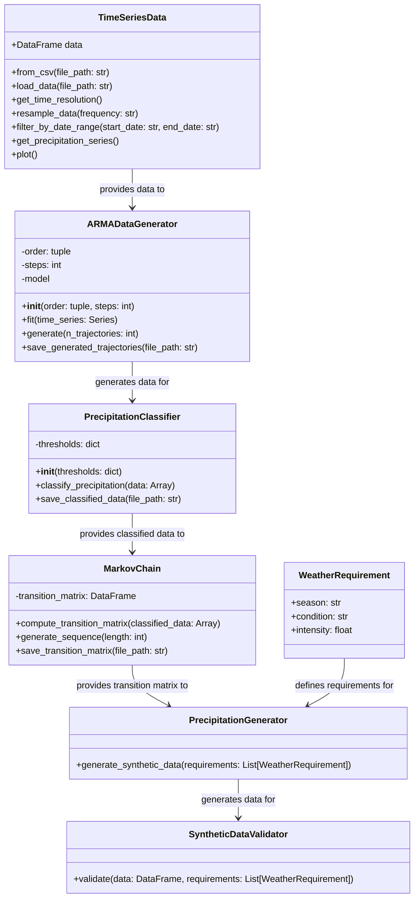

```mermaid
classDiagram
    class TimeSeriesData {
        +DataFrame data
        +from_csv(file_path: str)
        +load_data(file_path: str)
        +get_time_resolution()
        +resample_data(frequency: str)
        +filter_by_date_range(start_date: str, end_date: str)
        +get_precipitation_series()
        +plot()
    }

    class ARMADataGenerator {
        -order: tuple
        -steps: int
        -model
        +__init__(order: tuple, steps: int)
        +fit(time_series: Series)
        +generate(n_trajectories: int)
        +save_generated_trajectories(file_path: str)
    }

    class PrecipitationClassifier {
        -thresholds: dict
        +__init__(thresholds: dict)
        +classify_precipitation(data: Array)
        +save_classified_data(file_path: str)
    }

    class MarkovChain {
        -transition_matrix: DataFrame
        +compute_transition_matrix(classified_data: Array)
        +generate_sequence(length: int)
        +save_transition_matrix(file_path: str)
    }

    class WeatherRequirement {
        +season: str
        +condition: str
        +intensity: float
    }

    class SyntheticDataValidator {
        +validate(data: DataFrame, requirements: List[WeatherRequirement])
    }

    class PrecipitationGenerator {
        +generate_synthetic_data(requirements: List[WeatherRequirement])
    }

    TimeSeriesData --> ARMADataGenerator: provides data to
    ARMADataGenerator --> PrecipitationClassifier: generates data for
    PrecipitationClassifier --> MarkovChain: provides classified data to
    MarkovChain --> PrecipitationGenerator: provides transition matrix to
    WeatherRequirement --> PrecipitationGenerator: defines requirements for
    PrecipitationGenerator --> SyntheticDataValidator: generates data for
```